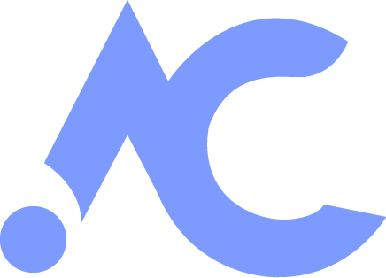

# Project implementation plan "Acrylic" 

<strong>Attention!</strong> *This cours work plan is preliminary, because the list of tasks to be solved in the process of creating a new version of the application may undergo significant processing. As the functionality is created, the plan will be revised.*

* [x] Repository registration github.com
* [x] Create a project and preparing it for development
* [x] Create Identity Server
* [x] Add authorization using the Oauth 2.0 approach and a JWT Bearer
* [x] Setting up adding an account
* [x]  Creating entities(classes) and configuring entities
    * [x] Employee
        * [x] Add modal windows to add a new record
        * [x] Add modal windows for updating records
        * [x] Add delete records
        * [x] Add pagination
        * [x] Add validation for fields on the view
        * [x] Add a search on the table
    * [ ] Сlient
        * [ ] Add modal windows to add a new record
        * [ ] Add modal windows for updating records
        * [ ] Add delete records
        * [ ] Add pagination
        * [ ] Add validation for fields on the view
        * [ ] Add a search on the table
    * [ ] Group 
        * [ ] Add modal windows to add a new record
        * [ ] Add modal windows for updating records
        * [ ] Add delete records
        * [ ] Add pagination
        * [ ] Add validation for fields on the view
        * [ ] Add a search on the table
* [x] Create a MongoDB database and connecting to it
* [x] Create a repository for data access
* [x] Create ViewModels for entities and configuring mapping (Automapper)
* [x] Add XUnit tests
    * [x] Test the AuthorizationProvider
    * [ ] Test the main business logic services
* [ ] Add the resulting charts (LiveCharts)
* [ ] Visualize data on the home page

